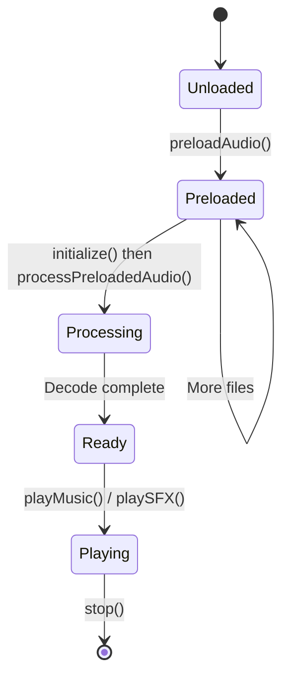

# MarkJSAudio Documentation Improvement Checklist

**Current Grade: B+ (87%)**  
**Target Grade: A- (92%) with Quick Wins | A (95%) with Comprehensive Updates**

---

## CRITICAL PRIORITY ⚠️ (Do Immediately)

### 1. Add Visual Diagrams
**Effort:** 4-6 hours | **Impact:** HIGH

- [ ] Create audio processing pipeline diagram (AudioContext → Gains → Destination)
- [ ] Create preloading workflow state diagram (Unloaded → Preloaded → Processing → Ready → Playing)
- [ ] Create volume hierarchy visualization (Master × Music/SFX)
- [ ] Create memory lifecycle diagram (ArrayBuffer → Raw Data → AudioBuffer)
- [ ] Use Mermaid.js or similar tool embeddable in Markdown
- [ ] Place diagrams in relevant sections (not all at once)

**Example to add in "ArrayBuffer & Preloading Overview":**
```markdown
### Preloading Workflow Visualization


```

### 2. Document Browser-Specific Behaviors
**Effort:** 2-3 hours | **Impact:** HIGH

- [ ] Add new section: "Browser-Specific Considerations"
- [ ] Document iOS/Safari requirements:
  - [ ] Requires actual touch event (not simulated click)
  - [ ] Silent mode prevents all audio playback
  - [ ] Stricter user interaction requirements
- [ ] Document Chrome autoplay policies
- [ ] Document mobile browser limitations:
  - [ ] Simultaneous playback limits (typically 32 sources)
  - [ ] Memory constraints
  - [ ] Background tab behavior
- [ ] Add Firefox audio format support notes
- [ ] Include detection code for mobile vs desktop

**Suggested location:** After "Browser Compatibility" section

### 3. Add Performance Benchmarks
**Effort:** 4-6 hours | **Impact:** MEDIUM

- [ ] Test and document memory usage:
  - [ ] MP3: ~1MB per minute
  - [ ] WAV: ~10MB per minute (uncompressed)
- [ ] Benchmark decode times:
  - [ ] MP3: 50-200ms typical
  - [ ] WAV: 10-50ms typical
- [ ] Test simultaneous playback limits
- [ ] Document recommended limits:
  - [ ] Mobile: <100MB total preloaded audio
  - [ ] Desktop: <500MB total preloaded audio
- [ ] Add code example for memory monitoring

**Suggested location:** New section "Performance & Optimization"

---

## HIGH PRIORITY 🔴 (Do Soon)

### 4. Create Table of Contents
**Effort:** 1 hour | **Impact:** MEDIUM

- [ ] Add clickable ToC at document start (after title and overview)
- [ ] Link all major sections with anchor links
- [ ] Use nested structure for subsections
- [ ] Verify all anchor links work correctly
- [ ] Consider adding "Back to Top" links in longer sections

**Template:**
```markdown
## Table of Contents

1. [Overview](#overview)
2. [Features](#features)
3. [ArrayBuffer & Preloading Overview](#arraybuffer--preloading-overview)
4. [Installation](#installation)
5. [Quick Start](#quick-start)
6. [API Reference](#api-reference)
   - [Constructor](#constructor)
   - [Initialization](#initialization)
   - [Audio Loading](#audio-loading)
   - ... (continue for all subsections)
7. [Usage Patterns](#usage-patterns)
8. [Error Handling](#error-handling)
9. [Browser Compatibility](#browser-compatibility)
10. [Performance Tips](#performance-tips)
```

### 5. Improve Troubleshooting Section
**Effort:** 2 hours | **Impact:** MEDIUM

- [ ] Add visual troubleshooting decision tree
- [ ] Create "Common Issues and Solutions" subsection
- [ ] Add FAQ format for quick answers
- [ ] Include browser DevTools debugging tips
- [ ] Add mobile-specific troubleshooting section

**Decision tree example:**
```markdown
### Troubleshooting Decision Tree

**Audio not playing?**
1. Did you call `initialize()` after user interaction? 
   - NO → Call after user click/touch
   - YES → Continue to step 2
2. Is audio loaded successfully?
   - NO → Check console for loading errors
   - YES → Continue to step 3
3. Is AudioContext running? (Check `audioContext.state`)
   - "suspended" → User interaction required
   - "running" → Continue to step 4
4. Is volume > 0? Check master, music, and SFX volumes
   - NO → Adjust volume settings
   - YES → Check browser console for errors
```

### 6. Add Error Message Reference
**Effort:** 1-2 hours | **Impact:** MEDIUM

- [ ] Document all `alert()` messages the library displays
- [ ] Categorize errors:
  - [ ] Initialization errors
  - [ ] Loading errors
  - [ ] Playback errors
- [ ] Provide solution for each error message
- [ ] Add section on alternative error handling (without alerts) for production
- [ ] Include example of custom error handling wrapper

**Suggested location:** Add to "Error Handling" section

---

## MEDIUM PRIORITY 🟡 (Valuable Enhancements)

### 7. Add Comparison with Alternatives
**Effort:** 3-4 hours | **Impact:** MEDIUM

- [ ] Research Howler.js, Tone.js, SoundJS features
- [ ] Create comparison table (features, size, use cases)
- [ ] Add "Why MarkJSAudio?" section
- [ ] List specific use cases for choosing MarkJSAudio
- [ ] Add "When to Choose Alternatives" subsection
- [ ] Keep tone objective and fair

**Suggested location:** New section after "Features", before "Installation"

### 8. Create Quick Reference Card
**Effort:** 1-2 hours | **Impact:** MEDIUM

- [ ] Add "Common Operations - Quick Reference" section
- [ ] Include most-used methods with minimal examples
- [ ] Format for easy scanning (tables or code blocks)
- [ ] Cover: Setup, Loading, Playback, Volume control
- [ ] Keep examples to 1-3 lines each

**Suggested location:** After "Quick Start" section

### 9. Add Best Practices Section
**Effort:** 3-4 hours | **Impact:** MEDIUM

- [ ] Consolidate scattered performance tips
- [ ] Add DO/DON'T examples for 8-10 common scenarios:
  - [ ] Initialization timing
  - [ ] Memory management
  - [ ] File format selection
  - [ ] Error handling
  - [ ] Volume hierarchy usage
  - [ ] Preloading strategy
  - [ ] Mobile optimization
  - [ ] Crossfading timing
- [ ] Use clear visual formatting (✅ DO / ❌ DON'T)
- [ ] Include code examples for each practice

**Suggested location:** New section before "Performance Tips"

### 10. Improve Cross-Referencing
**Effort:** 2-3 hours | **Impact:** LOW-MEDIUM

- [ ] Add "See also:" links in API Reference methods
- [ ] Link API methods to relevant Usage Patterns
- [ ] Add "Related sections:" to each major section
- [ ] Link Usage Patterns to API methods they use
- [ ] Create bidirectional links between concepts
- [ ] Add "Uses:" tags showing which APIs a pattern employs

**Example:**
```markdown
#### `preloadAudio(name, source): Promise<boolean>`
... (existing documentation)

**See also:** 
- [Progressive Audio Loading Strategy](#progressive-audio-loading-strategy)
- [Game Scene Management](#game-scene-management)
- [ArrayBuffer & Preloading Overview](#arraybuffer--preloading-overview)
```

---

## LOW PRIORITY 🟢 (Nice to Have)

### 11. Add Prerequisites Section
**Effort:** 1 hour | **Impact:** LOW

- [ ] Create "Prerequisites" section after "Features"
- [ ] List required knowledge:
  - [ ] JavaScript ES6+ (async/await, Promises, modules)
  - [ ] Basic audio concepts (volume, fade, loop)
  - [ ] HTML5 and DOM manipulation
- [ ] List helpful but not required knowledge
- [ ] Link to learning resources (MDN, etc.)
- [ ] Clarify browser/platform requirements

### 12. Create Interactive Examples
**Effort:** 8-12 hours | **Impact:** HIGH (if resourced)

- [ ] Build 4-5 live demo applications:
  - [ ] Basic playback demo
  - [ ] Preloading workflow demo
  - [ ] Game integration demo
  - [ ] Volume control UI demo
- [ ] Deploy to demo site (Netlify, Vercel, GitHub Pages)
- [ ] Create separate examples repository
- [ ] Link from main documentation
- [ ] Add QR codes for mobile testing

**Note:** This is high-effort but would significantly improve learning experience

### 13. Add Migration Guides
**Effort:** 2-3 hours | **Impact:** LOW

- [ ] Create "Migration Guides" section
- [ ] Add Howler.js → MarkJSAudio guide
- [ ] Add Native Web Audio API → MarkJSAudio guide
- [ ] Show side-by-side code comparisons
- [ ] Highlight key conceptual differences
- [ ] List common migration pitfalls

**Suggested location:** Appendix or separate document

### 14. Refactor Long Code Examples
**Effort:** 2-3 hours | **Impact:** LOW

- [ ] Review examples exceeding 30 lines
- [ ] Break into smaller focused examples where appropriate
- [ ] Use excerpt format ("...") for very long code
- [ ] Link to full examples in external repository
- [ ] Keep advanced examples intact in "Usage Patterns" section
- [ ] Add "See complete implementation" links

**Affected sections:**
- Custom Audio Integration class (~60 lines)
- WAV generation code (~100 lines)
- Dynamic Audio Manager class (~80 lines)

**Note:** Current long examples are appropriate for advanced section, but could be supplemented with excerpts

---

## Quick Wins Path (Option A) - 16-23 hours

Complete these to reach **A- grade (92%)**:

- [x] Items 1-6 (Critical + High Priority)
- Total: 14-18 hours of focused work
- Timeline: 2-3 days

---

## Comprehensive Enhancement (Option B) - 40-60 hours

Complete these to reach **A grade (95%)**:

- [x] Items 1-10 (Critical + High + Medium Priority)
- Total: 35-50 hours
- Timeline: 1-2 weeks

---

## Minimal Updates (Option C) - 6-8 hours

Complete these to maintain **B+ grade** while addressing critical gaps:

- [ ] Add 2 key diagrams (audio pipeline + preloading workflow)
- [ ] Add browser-specific considerations section
- [ ] Create basic table of contents
- Total: 6-8 hours
- Timeline: 1 day

---

## Progress Tracking

### Completed Items
- [ ] None yet

### In Progress
- [ ] None

### Blocked/Needs Discussion
- [ ] None

---

## Notes for Implementation

### Tools Recommended
- **Diagrams:** Mermaid.js (embeds in Markdown), Excalidraw, Draw.io
- **Table of Contents:** Auto-generate with markdown-toc or manually with anchor links
- **Testing:** Test on Chrome, Firefox, Safari (desktop + mobile)
- **Benchmarking:** Use Chrome DevTools Performance tab, Memory profiler

### Testing Checklist After Updates
- [ ] All anchor links work
- [ ] All code examples are syntactically correct
- [ ] All diagrams render correctly on GitHub
- [ ] Document flows logically from start to finish
- [ ] No broken formatting or markdown errors
- [ ] Table of contents is complete and accurate

### Style Guidelines
- Keep consistent tone (professional, technical, helpful)
- Use code blocks with language specification (```javascript)
- Use emoji sparingly in section headers (✅ ❌ ⚠️)
- Maintain consistent heading levels
- Keep paragraphs concise (3-5 sentences max)
- Use bullet points for lists of 3+ items

---

**Last Updated:** 2026-01-14  
**Next Review:** After completing Quick Wins path items  
**Target Completion:** [Add your target date]
